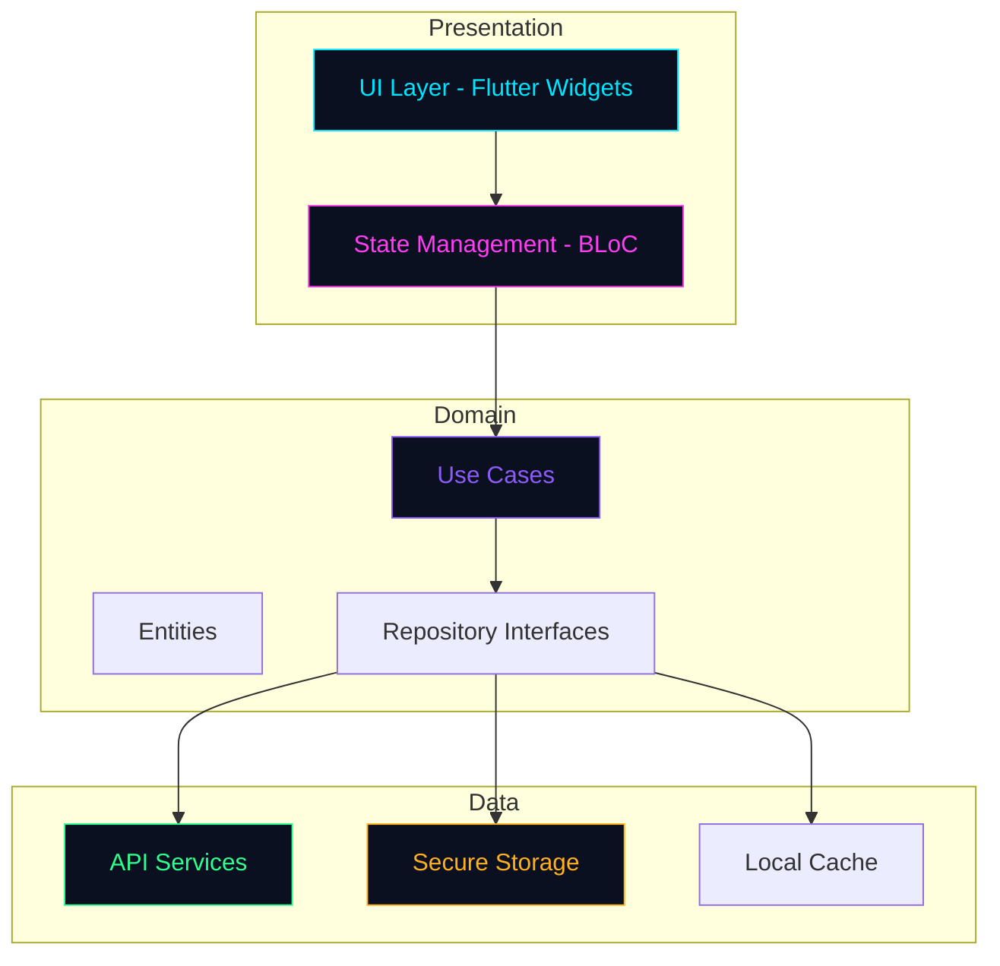
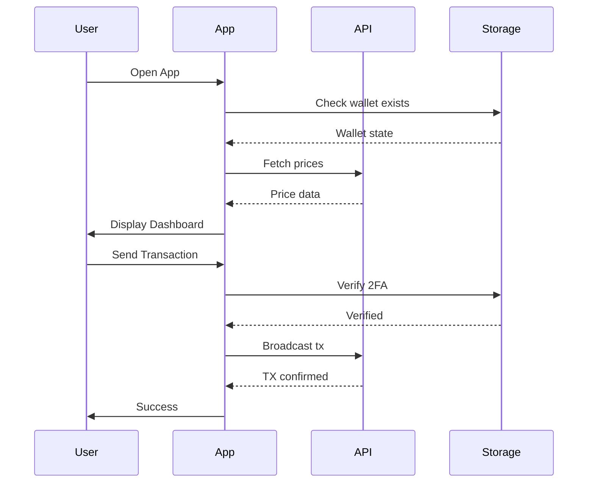
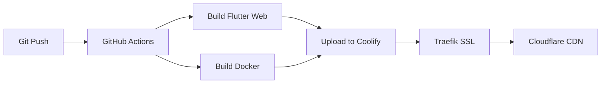

# <p align="center"></p>

<p align="center">
  <a href="https://github.com/softwareprosdev/flutterwebapplication"></a>
  <a href="https://github.com/softwareprosdev/flutterwebapplication"></a>
  <a href="https://github.com/softwareprosdev/flutterwebapplication"></a>
  <a href="https://github.com/softwareprosdev/flutterwebapplication"></a>
</p>

---

<p align="center">
  
</p>

## <p align="center">🔐 Secure • 🌍 Cross-Platform • ⚡ Enterprise-Grade</p>

---

## 📋 Table of Contents

- [Overview](#-overview)
- [Features](#-features)
- [Architecture](#-architecture)
- [Security](#-security)
- [Getting Started](#-getting-started)
- [Deployment](#-deployment)
- [Screenshots](#-screenshots)
- [Tech Stack](#-tech-stack)
- [Contributing](#-contributing)
- [License](#-license)

---

## 🌟 Overview

**Crypto Mecca Wallet** is an enterprise-grade, non-custodial cryptocurrency wallet built with Flutter. It provides comprehensive crypto asset management, portfolio tracking, mining ROI calculations, and affiliate e-commerce integration - all with a stunning neon-dark UI.

<p align="center">
  
  
  
</p>

---

## ✨ Features

### 🔑 Wallet Features
| Feature | Description |
|---------|-------------|
| **HD Wallet Generation** | BIP39 mnemonic generation with BIP32 derivation |
| **Multi-Chain Support** | Bitcoin, Ethereum, Solana support |
| **Secure Storage** | Platform-backed encrypted keystore |
| **2FA Integration** | TOTP-based two-factor authentication |
| **Address Whitelisting** | Trusted address management |

### 📊 Portfolio Features
| Feature | Description |
|---------|-------------|
| **Multi-Asset Tracking** | Track 50+ cryptocurrencies |
| **Profit/Loss Analysis** | Real-time P&L calculations |
| **Price Alerts** | Customizable notifications |
| **Historical Charts** | Interactive price history |

### ⛏️ Mining Features
| Feature | Description |
|---------|-------------|
| **ROI Calculator** | Calculate mining profitability |
| **Hardware Suggestions** | Recommended mining equipment |
| **Power Cost Analysis** | Electricity cost tracking |

### 🛒 E-Commerce Features
| Feature | Description |
|---------|-------------|
| **Hardware Wallets** | Ledger, Trezor affiliate links |
| **Mining Equipment** | Antminer, WhatsMiner deals |
| **Cold Storage** | Steel wallet backups |
| **Affiliate Tracking** | Commission tracking |

---

## 🏗️ Architecture

```mermaid
flowchart LR
    subgraph Security Layers
        SSL[SSL Pinning] --> AUTH[Authentication]
        AUTH --> ENC[Encryption]
        ENC --> WALLET[Wallet Security]
        WALLET --> COMPLIANCE[VASP Compliance]
    end
    
    subgraph Crypto Operations
        GEN[Key Generation] --> DERIVE[HD Derivation]
        DERIVE --> SIGN[Transaction Signing]
        SIGN --> VERIFY[Verification]
    end
    
    style Security Layers fill:#05070D,stroke:#00E5FF,stroke-width:2px
    style Crypto Operations fill:#05070D,stroke:#FF3DF2,stroke-width:2px
```







---

## 🔒 Security

### Implemented Security Measures

```
┌─────────────────────────────────────────────────────────────┐
│                    SECURITY LAYERS                           │
├─────────────────────────────────────────────────────────────┤
│  🔐 SSL/TLS Pinning        →  Dio Interceptors            │
│  🔐 Secure Storage         →  flutter_secure_storage      │
│  🔐 HD Wallet              →  BIP39/BIP32                 │
│  🔐 2FA                   →  TOTP Algorithm               │
│  🔐 Transaction Verify     →  Address Whitelisting        │
│  🔐 Code Obfuscation      →  Flutter Obfuscator          │
│  🔐 VASP Compliance       →  US/EU/UK/CA/KR              │
└─────────────────────────────────────────────────────────────┘
```

### VASP Compliance Jurisdictions

| Region | Regulator | Status |
|--------|-----------|--------|
| 🇺🇸 USA | FinCEN | ✅ Compliant |
| 🇪🇺 EU | AMLD5/6 | ✅ Compliant |
| 🇬🇧 UK | FCA | ✅ Compliant |
| 🇨🇦 Canada | FINTRAC | ✅ Compliant |
| 🇰🇷 South Korea | PFSO | ✅ Compliant |

---

## 🚀 Getting Started

### Prerequisites

```bash
# Required tools
Flutter SDK >= 3.24.0
Dart SDK >= 3.5.0
Docker (optional)
Git
```

### Installation

```bash
# Clone the repository
git clone https://github.com/softwareprosdev/flutterwebapplication.git
cd flutterwebapplication

# Install dependencies
flutter pub get

# Run in development mode
flutter run

# Build for web
flutter build web --release --tree-shake-icons --wasm --web-renderer skwasm
```

### Environment Variables

Create `.env` file:

```env
# API Keys
COINGECKO_API_KEY=your_api_key
INFURA_PROJECT_ID=your_infura_id
ALCHEMY_API_KEY=your_alchemy_key

# RevenueCat (iOS/Android)
REVENUECAT_API_KEY=test_xxx

# Affiliate Links
LEDGER_AFFILIATE_ID=your_ledger_id
TREZOR_AFFILIATE_ID=your_trezor_id
```

---

## 📦 Build & Deployment

### Web Build

```bash
# Production build with all optimizations
flutter build web \
  --release \
  --tree-shake-icons \
  --wasm \
  --web-renderer skwasm \
  --no-source-maps

# Output: build/web/
```

### Docker Build

```bash
# Build Docker image
docker build -t crypto-mecca-wallet .

# Run container
docker run -d -p 8080:8080 crypto-mecca-wallet
```

### Deploy to Coolify



1. **Create Coolify App** → Select "Docker" type
2. **Configure Domain** → `cal.zerodayinstitute.com`
3. **Set Environment** → Add API keys
4. **Deploy** → Connect GitHub repository

---

## 🖥️ Screenshots

<p align="center">
  
  
  
</p>

### UI Color Palette

| Color | Hex | Usage |
|-------|-----|-------|
| 🔵 Primary Neon | `#00E5FF` | Main accent, buttons |
| 🟣 Secondary Neon | `#FF3DF2` | Secondary actions |
| 🟢 Accent Lime | `#2DFF8F` | Success states |
| 🟠 Warning | `#FFB020` | Warnings |
| 🔴 Error | `#FF4757` | Errors |
| ⚫ Background | `#05070D` | Dark base |
| ⚪ Surface | `#0B1020` | Cards, panels |

---

## 🛠️ Tech Stack

### Framework & Language

<p align="left">
  
  
</p>

### State Management

<p align="left">
  
  
</p>

### Security

| Package | Purpose |
|---------|---------|
| `flutter_secure_storage` | Encrypted key storage |
| `bip39` / `bip32` | HD wallet derivation |
| `encrypt` | AES encryption |
| `otp` | 2FA TOTP |
| `crypto` | Hashing functions |

### Networking

| Package | Purpose |
|---------|---------|
| `dio` | HTTP client with interceptors |
| `http` | REST API calls |

### UI/UX

| Package | Purpose |
|---------|---------|
| `fl_chart` | Charts & graphs |
| `google_fonts` | Typography |
| `shimmer` | Loading effects |

---

## 📁 Project Structure

```
crypto_mecca_wallet/
├── lib/
│   ├── core/
│   │   ├── constants/       # Colors, configs
│   │   ├── theme/           # App theme
│   │   ├── security/         # Wallet, 2FA, encryption
│   │   ├── network/          # SSL pinning
│   │   └── compliance/       # VASP compliance
│   ├── data/
│   │   ├── models/          # Data models
│   │   ├── repositories/    # Data access
│   │   └── services/        # API services
│   └── presentation/
│       ├── screens/          # UI screens
│       ├── widgets/          # Reusable widgets
│       └── bloc/             # State management
├── assets/                   # Images, fonts
├── scripts/                  # Build scripts
├── docker/                   # Docker configs
└── .github/
    └── workflows/            # CI/CD pipelines
```

---

## 🤝 Contributing

1. **Fork** the repository
2. **Create** your feature branch (`git checkout -b feature/amazing-feature`)
3. **Commit** your changes (`git commit -m 'Add amazing feature'`)
4. **Push** to the branch (`git push origin feature/amazing-feature`)
5. **Open** a Pull Request

---

## 📄 License

MIT License - see [LICENSE](LICENSE) for details.

---

## 🙏 Acknowledgments

- [CoinGecko API](https://www.coingecko.com) - Crypto price data
- [Flutter Team](https://flutter.dev) - Cross-platform framework
- [Ledger](https://www.ledger.com) - Hardware wallet partner
- [Trezor](https://www.trezor.io) - Hardware wallet partner

---

<p align="center">
  
</p>

---

<p align="center">
  <sub>© 2026 Crypto Mecca Wallet. All rights reserved.</sub>
</p>